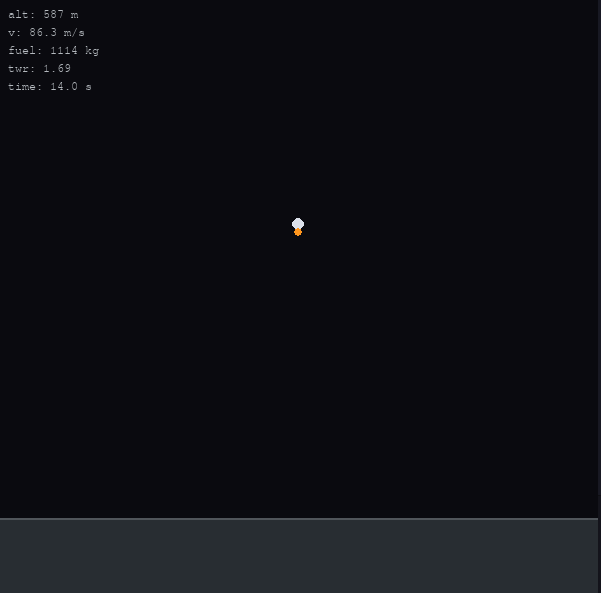

# minirocket

Minimal rocket ascent simulation using the Tsiolkovsky rocket equation.  
A single file, no interaction just Newton and a bit of fuel math.

> *instead of studying for my Maths test due tomorrow*

## Demo




## Run

```bash
pip install pygame
python minirocket.py
